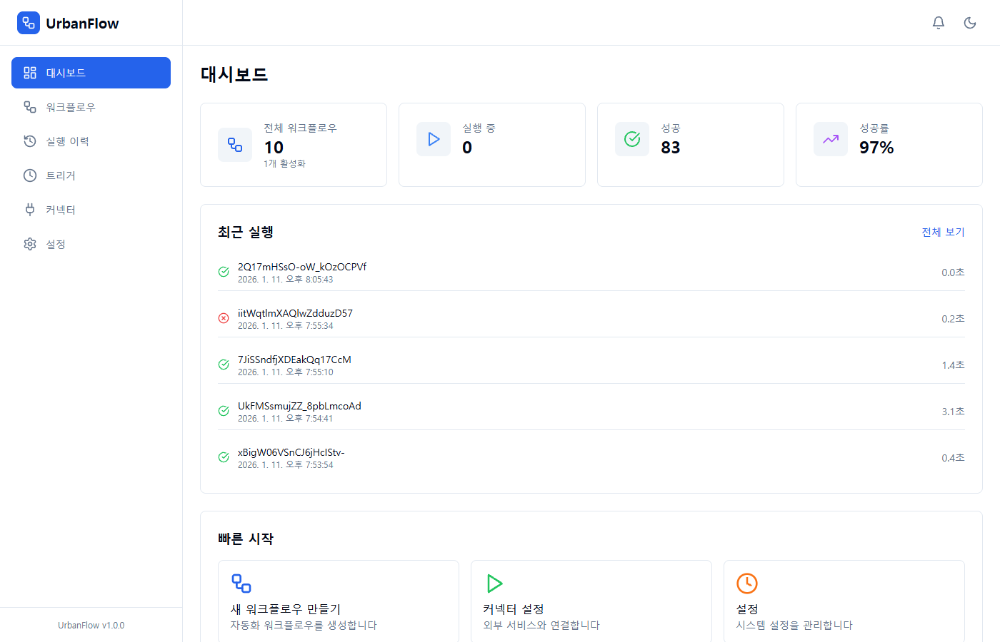
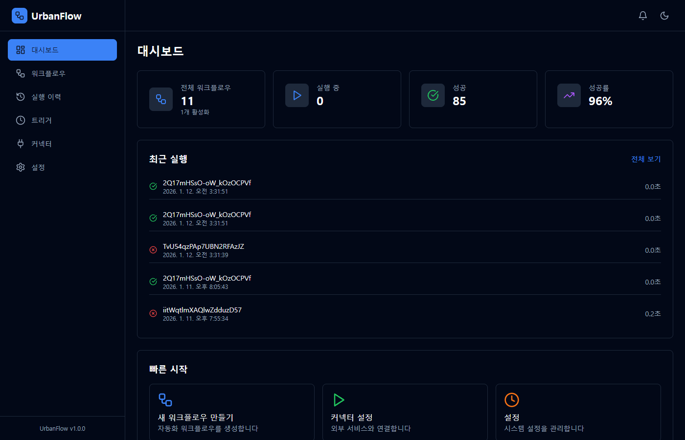
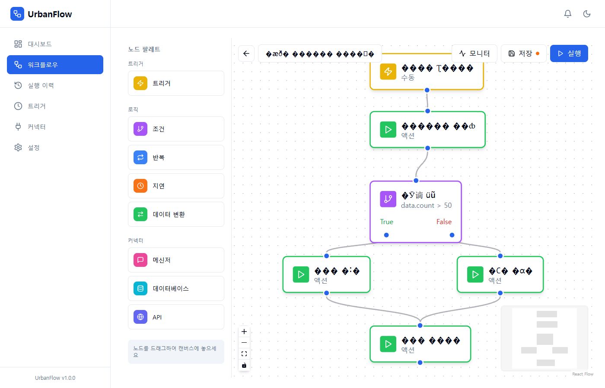
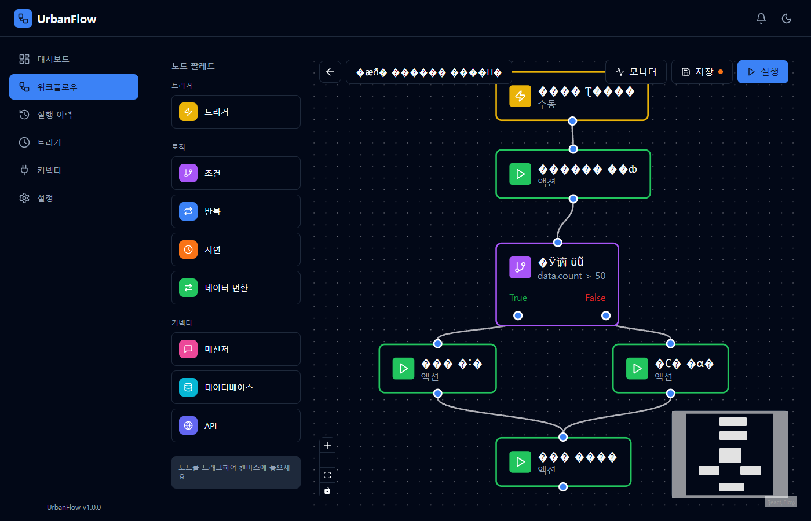
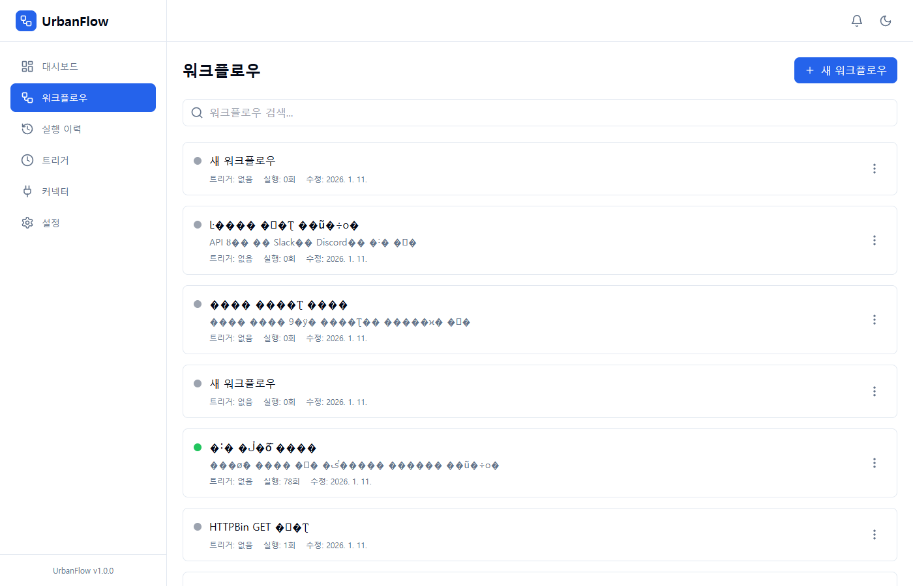
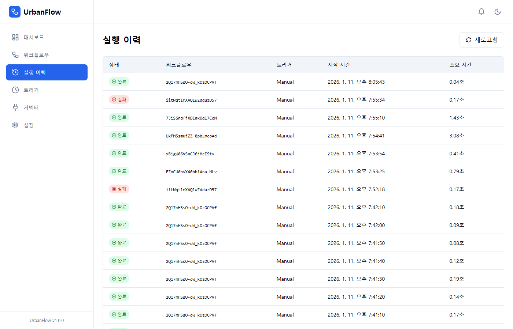
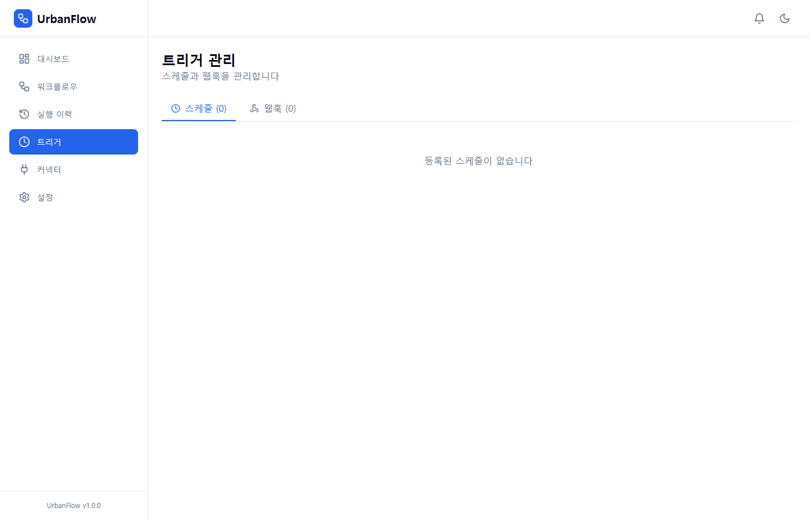
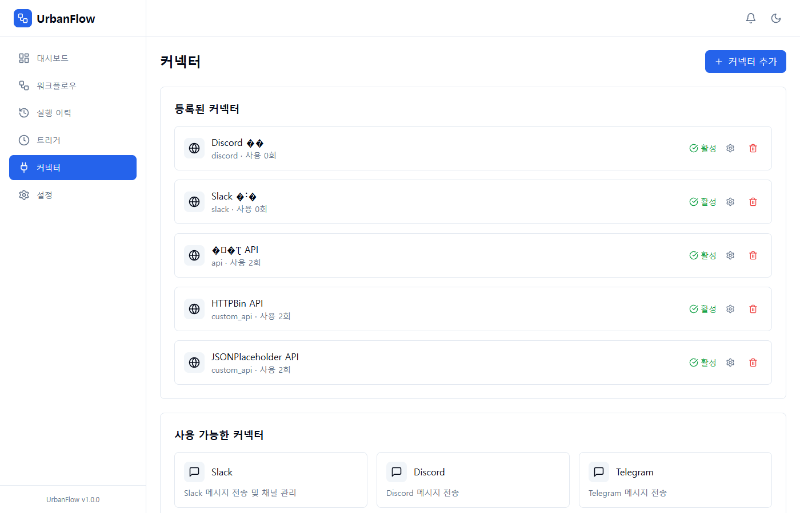
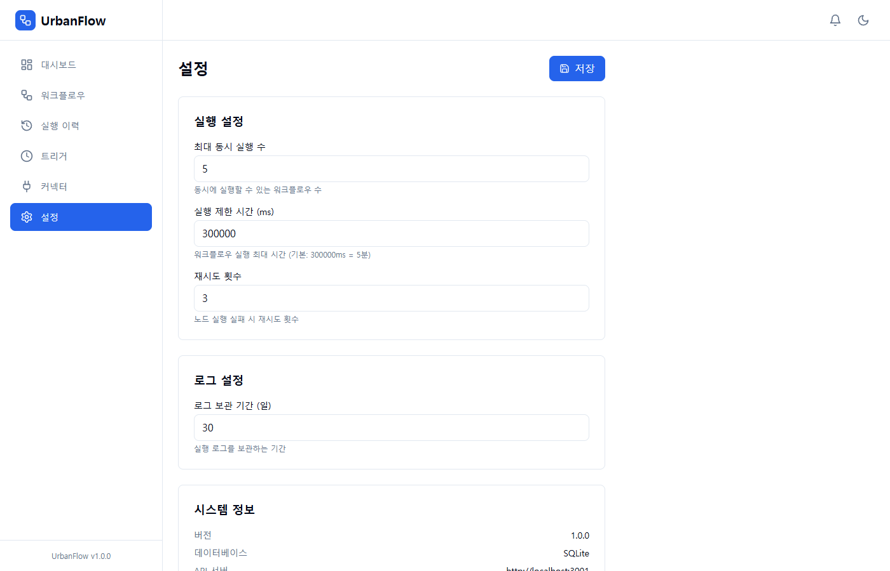

# UrbanFlow

Make.com 스타일의 워크플로우 자동화 플랫폼



## 주요 기능

- **비주얼 워크플로우 에디터**: React Flow 기반 드래그앤드롭 노드 편집
- **다양한 트리거**: 수동 실행, Webhook, Cron 스케줄
- **커넥터 지원**: Slack, Discord, Telegram, MySQL, PostgreSQL, MongoDB, Custom API
- **실시간 모니터링**: WebSocket 기반 실행 상태 추적
- **다크 모드**: 라이트/다크 테마 지원

## 스크린샷

### 대시보드
통계, 최근 실행 이력, 빠른 시작 메뉴를 제공합니다.

| 라이트 모드 | 다크 모드 |
|-------------|-----------|
|  |  |

### 워크플로우 에디터
노드를 드래그하여 워크플로우를 시각적으로 구성합니다.

| 라이트 모드 | 다크 모드 |
|-------------|-----------|
|  |  |

### 워크플로우 목록
생성된 워크플로우를 관리합니다.



### 실행 이력
워크플로우 실행 기록과 상태를 확인합니다.



### 트리거 관리
스케줄과 웹훅을 설정합니다.



### 커넥터
외부 서비스 연동을 관리합니다.



### 설정
시스템 설정을 관리합니다.



## 기술 스택

### Backend
- **Express.js** + TypeScript
- **sql.js** (SQLite)
- **WebSocket** (실시간 통신)
- **node-cron** (스케줄링)

### Frontend
- **React 18** + TypeScript
- **@xyflow/react** (React Flow)
- **Zustand** (상태 관리)
- **TanStack Query** (서버 상태)
- **Tailwind CSS** + shadcn/ui

### 프로젝트 구조
```
urbanflow/
├── apps/
│   ├── server/          # Express 백엔드
│   │   ├── src/
│   │   │   ├── config/      # 환경 설정
│   │   │   ├── database/    # DB 스키마, 리포지토리
│   │   │   ├── engine/      # 워크플로우 실행 엔진
│   │   │   ├── routes/      # API 라우트
│   │   │   └── connectors/  # 외부 서비스 커넥터
│   │   └── ...
│   └── web/             # React 프론트엔드
│       ├── src/
│       │   ├── components/  # UI 컴포넌트
│       │   ├── pages/       # 페이지
│       │   ├── stores/      # Zustand 스토어
│       │   └── hooks/       # 커스텀 훅
│       └── ...
└── packages/
    └── shared/          # 공유 타입, 상수
```

## 설치 및 실행

### 요구사항
- Node.js 18+
- npm 9+

### 설치
```bash
git clone https://github.com/diorbuzz/urbanflow.git
cd urbanflow
npm install
```

### 개발 서버 실행
```bash
npm run dev
```

- **프론트엔드**: http://localhost:5173
- **백엔드 API**: http://localhost:3001/api
- **WebSocket**: ws://localhost:3001/ws

### 빌드
```bash
npm run build
```

## API 엔드포인트

| Method | Endpoint | 설명 |
|--------|----------|------|
| GET | /api/workflows | 워크플로우 목록 |
| POST | /api/workflows | 워크플로우 생성 |
| GET | /api/workflows/:id | 워크플로우 상세 |
| PUT | /api/workflows/:id | 워크플로우 수정 |
| DELETE | /api/workflows/:id | 워크플로우 삭제 |
| POST | /api/workflows/:id/execute | 워크플로우 실행 |
| GET | /api/executions | 실행 이력 |
| GET | /api/connectors | 커넥터 목록 |
| GET | /api/triggers/schedules | 스케줄 목록 |
| GET | /api/triggers/webhooks | 웹훅 목록 |
| POST | /webhook/:path | 웹훅 트리거 |

## 노드 타입

| 타입 | 설명 |
|------|------|
| **트리거** | 워크플로우 시작점 (Manual, Webhook, Cron) |
| **조건** | if/else 분기 처리 |
| **반복** | 루프 처리 |
| **지연** | 대기 시간 설정 |
| **데이터 변환** | 데이터 가공 |
| **메신저** | Slack, Discord, Telegram |
| **데이터베이스** | MySQL, PostgreSQL, MongoDB |
| **API** | Custom HTTP 요청 |

## 라이선스

MIT License

---

Made with Claude Code
